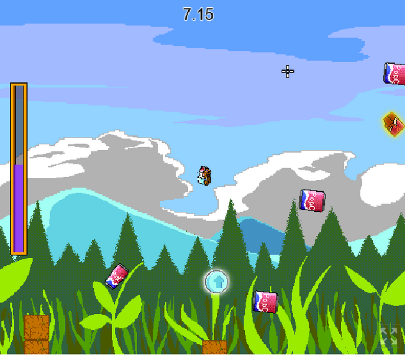
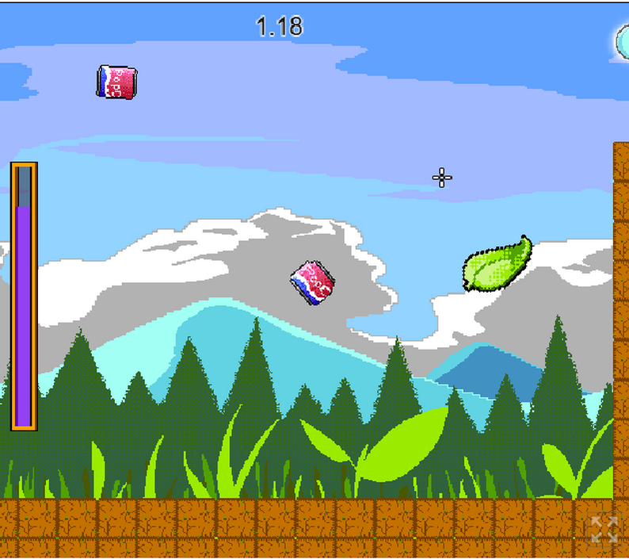

[JAVASCRIPT__BADGE]: https://img.shields.io/badge/Javascript-000?style=for-the-badge&logo=javascript
[KRITA__BADGE]: https://img.shields.io/badge/Krita-203759?style=for-the-badge&logo=krita&logoColor=EEF37B
[PHOTOSHOP__BADGE]: https://img.shields.io/badge/Adobe%20Photoshop-31A8FF?style=for-the-badge&logo=Adobe%20Photoshop&logoColor=black
[ITCHIO__BADGE]: https://img.shields.io/badge/Itch.io-FA5C5C?style=for-the-badge&logo=itchdotio&logoColor=white
[TRELLO__BADGE]: https://img.shields.io/badge/Trello-0052CC?style=for-the-badge&logo=trello&logoColor=white
[GIT__BADGE]: https://img.shields.io/badge/GIT-E44C30?style=for-the-badge&logo=git&logoColor=white

    

<a align="center" href="https://ldjam.com/events/ludum-dare/56">Ludum Dare 56 website</a>
<h1 align="center" style="font-weight: bold;">Mint Olimpics💻</h1>

 

![javascript][JAVASCRIPT__BADGE]
![krita][KRITA__BADGE]
![photoshop][PHOTOSHOP__BADGE]
[![itch.io][ITCHIO__BADGE]](https://games-ever-made.itch.io/mintolympics)
![trello][TRELLO__BADGE]
![git][GIT__BADGE]

 <a href="#about">About</a> • 
 <a href="#controls">Controls</a> • 
   •
 <a href="#contribute">Contribute</a>

    </img> |
    </img>

<h2 id="started">About 📌 </h2>

After being inspired by an unbelievable scene of monkeys jumping between barrels, Ant-onio and his friends got together to hold an Olympics in the wild.

The highlight of the competition is the legendary Soda-Mint Jumping. In this thrilling event, contestants use the explosive power of soda-mint reactions to propel themselves to new heights! Mastering this unique challenge will require precision, timing, and a bit of daring.

Mint Olympics is a charming indie platformer that puts you in the tiny shoes of a determined ant on a grand mission: to win the prestigious Ant Olympics! You’ll guide your agile hero through a series of soda cans, propelling yourself with small pieces of mint candies.

Your mission is to jump between the cans until you reach the end of the route, inside the red arch. Your accuracy and speed to reach the end of the route will be evaluated, and your grade will be awarded based on these criteria. You must calculate your mouse angle and power well, to be able to reach the cans at the right time.

Visit our project, clicking on the button bellow

[![itch.io][ITCHIO__BADGE]](https://games-ever-made.itch.io/mintolympics)

 
<h2 id="controls">Controls 🕹️</h2>

| Input                   |        Description       |
|------------------------:|:-------------------------|
| Q                       | Retun to level selection |
| R                       | Quick-Restart Level      |
| Mouse                   | Aim                      |
| Any mouse Button        | Jump                     |

 

<h2 id="colab">🤝 Collaborators</h2>

Special thank you for all people that contributed for this project.

<table>
  <tr>
    <td align="center">
      <a href="https://github.com/lindotex">
         
        
          <b>Alisson Lindote</b> 
          <i>Intern</i>
        
      </a>
    </td>
    <td align="center">
      <a href="https://github.com/andrew-mendes">
         
        
          <b>Andrew Mendes</b> 
          <i>Art Master</i>
        
      </a>
    </td>
    <td align="center">
      <a href="https://github.com/fgil90">
         
        
          <b>Felipe Gil</b> 
          <i>Dev Junior</i>
        
      </a>
    </td>
    <td align="center">
      <a href="https://github.com/MarceloLMoreira">
         
        
          <b>Marcelo 'Holysparks'</b> 
          <i>Dev Senior</i>
        
      </a>
    </td>
  </tr>
</table>

## References

List of all references used for this game

## Special tanks and Aknowledges

List of Special tanks and Aknowledges

